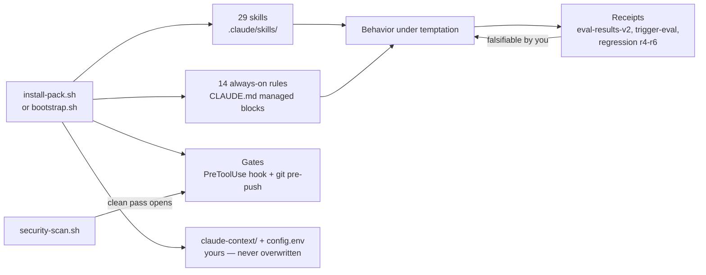

# Rules with Receipts

[](https://github.com/ralfyishere/rules-with-receipts/actions/workflows/ci.yml)
[](https://github.com/ralfyishere/rules-with-receipts/releases)
[](LICENSE)

**A testable operating discipline for AI coding agents — 29 skills, 14 always-on rules, publish/closeout gates, and the eval evidence showing exactly what it does and doesn't change.**

## The problem

Every agent rules file ships on vibes: "makes your agent 10x better," zero evidence. Meanwhile
agents fail in *repeatable* ways — claiming work is done without running it, bundling
unrequested changes, missing the hidden ninth usage and saying "fully migrated." Rules that
claim to fix this are almost never tested, and most of them do nothing.

This pack is the opposite bet: a discipline layer that ships with its own eval harness,
publishes the A/B numbers — **including the findings that don't flatter us** — and installs
deterministic gates that work even when the model forgets.

## Who it's for

Anyone running Claude Code on work that matters: teams shipping with agents, solo builders who
can't babysit every session, and skeptics who want to test any rules file (including this one)
before trusting it.

## Install in 60 seconds

```bash
curl -fsSL https://raw.githubusercontent.com/ralfyishere/rules-with-receipts/main/bootstrap.sh | bash -s -- /path/to/your/project
```

Prefer to read before you run (we would — see [SECURITY.md](SECURITY.md)):

```bash
git clone https://github.com/ralfyishere/rules-with-receipts.git
./rules-with-receipts/install-pack.sh /path/to/your/project
```

Verify (the installer runs the first two automatically):

```bash
cd /path/to/your/project
./scripts/check-pack.sh && ./scripts/closeout-check.sh && ./scripts/test-hygiene-gate.sh
```

Upgrades: `./install-pack.sh --upgrade /path/to/project` — preserves your context, config,
custom skills, and CLAUDE.md notes outside the managed blocks. New computer:
[BOOTSTRAP-NEW-MACHINE.md](BOOTSTRAP-NEW-MACHINE.md).

## What changes after install

- **Tighter scope:** asked for a flag, you get a flag — adjacent problems get *flagged in prose*, not silently "fixed."
- **Evidence-first claims:** verification runs and its output gets quoted; "should work" is treated as a prediction, not a result.
- **A publish gate that doesn't rely on memory:** pushes, releases, and package publishes are blocked — in Claude sessions *and* your own terminal — until the project's security scan passes.
- **Completion discipline:** "done" requires a closeout check; unchecked things get named as unchecked.
- **Compounding:** hard problems leave learning notes; recurring workflows get promoted into skills.

Under the hood: `.claude/skills/` (29 procedures), managed CLAUDE.md blocks (operating manual +
14 always-on rules), a PreToolUse hook plus a native git pre-push hook, per-project
`.quality-pack/config.env`, and starter `claude-context/` files the installer never overwrites.

## Architecture



## The receipts

Two generations of trap evals across five install configurations, fresh isolated sessions per
cell, rubrics written before grading, raw outputs published:

- **Baseline models are already strong.** Plain Opus 4.8 passed ~90% of our own traps unaided. Anyone claiming their rules transform model intelligence should show you receipts.
- **What measurably moved: discipline under temptation.** The full install was the only configuration to pass the scope-control trap 3/3 (minimal diff *plus* the adjacent bug flagged). The always-on snippet carries that effect — skills alone missed the flag in every rep.
- **Independent cross-check:** [rulebench](https://github.com/ralfyishere/rulebench)'s first published run did **not** reproduce our 3/3 headline (run-to-run variance is real; both results are published), and its [six-pack study](https://github.com/ralfyishere/rulebench/blob/main/study/STUDY.md) found the one trap that differentiated — honest completion accounting — favored the two packs that demand explicit verification, this one included.

Full numbers, rubrics, raw outputs, limitations:
[`eval-results-v2/SCORES.md`](eval-results-v2/SCORES.md) ·
[`HARD-FAILURE-ANALYSIS.md`](eval-results-v2/HARD-FAILURE-ANALYSIS.md). Every release passes a
[13-item checklist](RELEASE-CHECKLIST.md) including a cold-start install test with captured exit
codes ([`scripts/release-test.sh`](scripts/release-test.sh)) — CI runs it on every push.

## What this is not

- **Not an intelligence upgrade.** Same model, better discipline; the evidence says exactly how narrow the gains are.
- **Not a benchmark of general capability**, and not a safety guarantee — the gates reduce specific failure classes; they don't make agents safe to leave unsupervised.
- **Not a replacement for human review.** The operator guide (`.claude/OPERATOR-GUIDE.md`) is half the product.
- **Not a jailbreak or prompt pack.** The opposite: it treats rules files — including itself — as untrusted code. See [SECURITY.md](SECURITY.md).

## Test it yourself (please do)

```bash
cd eval-results-v2
REP_START=4 ./run-eval-v2.sh A,E t04 6   # baseline vs full install on the scope-control trap (reps 4–6; shipped evidence is immutable and the harness refuses to overwrite it)
```

Different numbers? Open an issue with your raw outputs — a disconfirming replication is a
first-class contribution ([CONTRIBUTING.md](CONTRIBUTING.md)).

## The Receipts System

| Repo | Role |
|---|---|
| [agent-zero-trust](https://github.com/ralfyishere/agent-zero-trust) | **Intake**: scan a repo's instruction environment before any agent enters it |
| **rules-with-receipts** (this repo) | Install the operating discipline |
| [rulebench](https://github.com/ralfyishere/rulebench) | Test whether any rules file actually does anything |
| [agent-failure-modes](https://github.com/ralfyishere/agent-failure-modes) | The AFM Index: named, numbered agent failures with detection traps and evidence grades |

## Provenance

Authored by Claude (Fable 5) sessions in collaboration with a human maintainer; evaluated
against Claude Opus 4.8. The pack transfers *process* — planning, verification, scope, and
recovery habits — and claims nothing about changing model capability. It does not reproduce,
extract, or imitate any model's internals.

## License

MIT — see [`LICENSE`](LICENSE).
